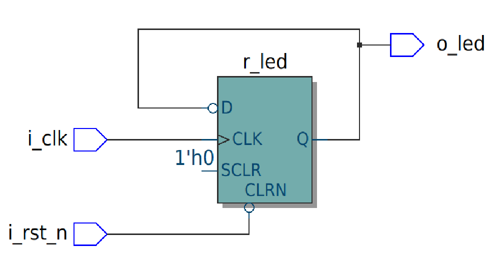
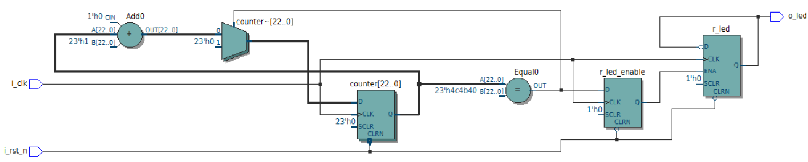
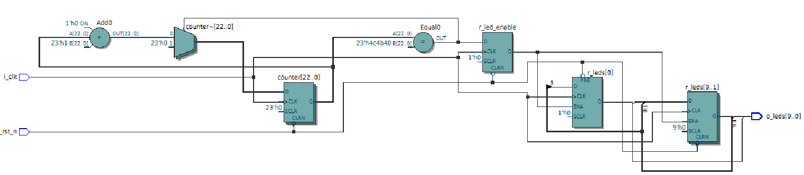

# 2627_2A_FPGA_MALEPART_M-TIR
# 🛠️ Tutoriel Prise en Main FPGA — Quartus Prime & VHDL

Ce dépôt contient le code source VHDL, la configuration des broches (Pin Planner) et les instructions pas à pas pour la prise en main du logiciel **Intel Quartus Prime Lite** et le ciblage d'une carte FPGA Intel / Altera Cyclone V.

---

## 📌 Présentation du TP

L'objectif de ce TP est de se familiariser avec le flux de conception FPGA :
1. Configuration de l'environnement sous **Quartus Prime Lite v24.1**.
2. Synthèse et affectation des broches I/O (*Pin Planner*).
3. Programmation de la cible via le programmateur **USB Blaster II**.
4. Implémentation d'un composant combinatoire simple (allumage d'une LED par bouton poussoir).
5. Conception séquentielle : division de fréquence d'horloge pour le clignotement d'une LED.
6. Conception et programmation d'un **chenillard**.
7. Conclusion

---

## 🔌 Matériel & Prérequis

### Logiciels
- **Quartus Prime Lite Edition v24.1** (gratuit, disponible sur Windows et Linux).
- *(Simulation préalable : ModelSim)*.

### Carte FPGA & Composants
- **FPGA cible :** Cyclone V — `5CSEBA6U23I7`
- **Programmation :** Port USB dédié **USB BLASTER II** (situé côté alimentation & HDMI).


---

## 🚀 Étapes de Configuration du Projet
Lors de la création du fichier on sélectionne le FPGA **`5CSEBA6U23I7`** *(on fait attention à ne pas choisir les variantes L ou S)*.
</details>


---


### Exercice 1 : Contrôle Combinatoire Simple (`tuto_fpga.vhd`)

On exécute le code fourni par le tp. Dans le cadre d'un tuto, l'objectif de ce code est de simplement allumé une LED lorsque le bouton poussoir est maintenu.
Pour faire allumer la LED, on se rend dans le PIN Planner afin d'assigner chaque sortie et entrée à une Pin de la carte. Une fois fait on compile le programme puis on l'implémente dans la carte.

---


### Exercice 2 : Logique séquentielle et division d'horloge (`led_blink.vhd`)

On exécute le code fourni par le tp. On visualise le schéma ci-dessous grâce à la fonctionalité RTL:

On compile le programme et on remarque que la led ne clignote pas ! .
On va donc modifier le code pour que l'on puisse visualiser le clignotement de la LED en ajoutant une horloge qui va être gérer par un process:

```vhdl
library ieee;
use ieee.std_logic_1164.all;

entity led_blink is
    port (
        i_clk   : in std_logic;
        i_rst_n : in std_logic;
        o_led   : out std_logic
    );
end entity led_blink;

architecture rtl of led_blink is
    signal r_led        : std_logic := '0';
    signal r_led_enable : std_logic := '0';
begin

    process(i_clk, i_rst_n)
        variable counter : natural range 0 to 5000000 := 0;
    begin
        if (i_rst_n = '0') then
            counter := 0;
            r_led_enable <= '0';
        elsif (rising_edge(i_clk)) then
            if (counter = 5000000) then
                counter := 0;
                r_led_enable <= '1';
            else
                counter := counter + 1;
                r_led_enable <= '0';
            end if;
        end if;
    end process;
    
    process(i_clk, i_rst_n)
    begin
        if (i_rst_n = '0') then
            r_led <= '0';
        elsif (rising_edge(i_clk)) then
            if (r_led_enable = '1') then
                r_led <= not r_led;
            end if;
        end if;
    end process;

    o_led <= r_led;

end architecture rtl;
```
On réalise le schéma avec RTL:



Une fois fait on assigne les PIN de l'horloge et du reset dans le PIN PLanner et on compile. On implémente le programme et on peut désormais visualiser le clignotement.

### Exercice 3 : Conception et programmation d'un **chenillard**

On souhaite désormais faire un chenillard, pour cela on va utiliser le code précédent afin de la réaliser, tous en le modidian:
```vhdl
library ieee;
use ieee.std_logic_1164.all;

entity led_blink is
    port (
        i_clk   : in  std_logic;
        i_rst_n : in  std_logic;
        o_leds  : out std_logic_vector(9 downto 0)
    );
end entity led_blink;

architecture rtl of led_blink is
    constant CLK : integer := 5000000;
    signal r_leds : std_logic_vector(9 downto 0) := "0000000001";
    signal r_led_enable : std_logic := '0';

begin
   process(i_clk, i_rst_n)
        variable counter : natural range 0 to CLK;
    begin
        if (i_rst_n = '0') then
            counter := 0;
            r_led_enable <= '0';
        elsif (rising_edge(i_clk)) then
            if (counter = CLK) then
                counter := 0;
                r_led_enable <= '1';
            else
                counter := counter + 1;
                r_led_enable <= '0';
            end if;
        end if;
    end process;

    process(i_clk, i_rst_n)
    begin
        if (i_rst_n = '0') then
            r_leds <= "0000000001";
        elsif rising_edge(i_clk) then
            if (r_led_enable = '1') then
                r_leds <= r_leds(8 downto 0) & r_leds(9);
            end if;
        end if;
    end process;

    o_leds <= r_leds;
end architecture rtl;
```
Par exemple, dans ce code nous avons remplacé la led qui etait en std_logic pour la faire passer en std_logic_vector afin de pouvoir commander 10 leds et faire incrémenter les leds du chenillard.

On a récupéré le schéma bloc:


Puis assigner les pins a toute les leds:

### LEDs
| Nom  | GPIO  | FPGA |
| :--- |:-----:| ----:|
| LED0 | J1:5  | AG28 |
| LED1 | J1:7  | AE25 |
| LED2 | J1:9  | AG26 |
| LED3 | J1:13 | AG25 |
| LED4 | J1:17 | AG23 |
| LED5 | J1:21 | AH21 |
| LED6 | J1:25 | AF22 |
| LED7 | J1:27 | AG20 |
| LED8 | J1:33 | AG18 |
| LED9 | J1:37 | AG15 |

Enfin on a compiler et implémenter le programme ainsi que visualiser le chenillard sur la carte.

## Conclusion
Durant ce TP, nous sommes parvenu a correctement prendre en main le logiciel Quartus, faire analyser, assigner et compiler le programme et le visualiser sur la carte


---


